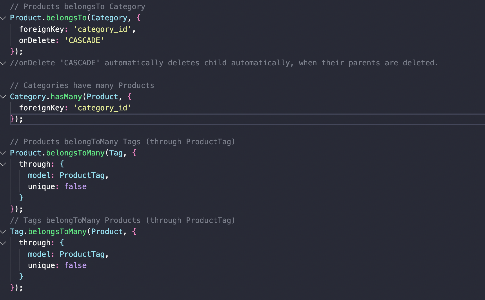
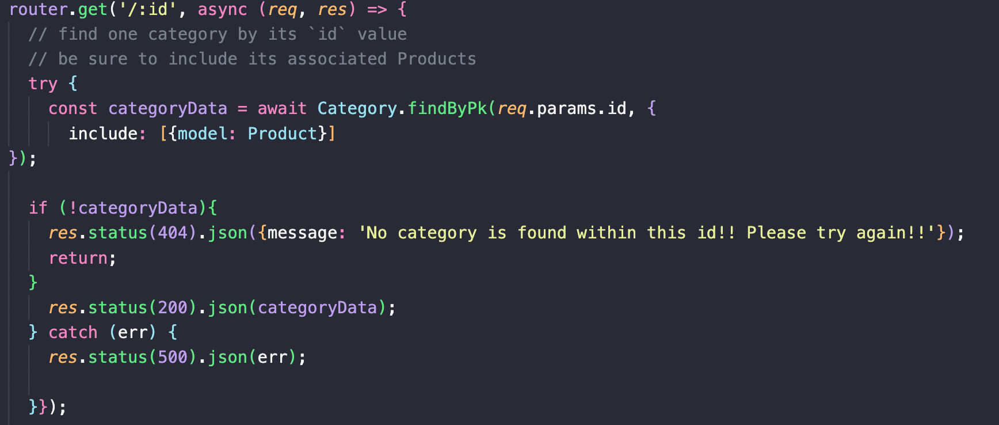
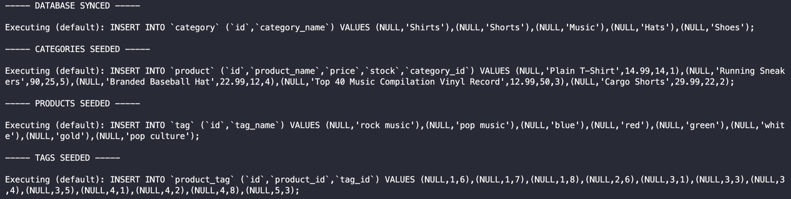

## design-mock-up///shopify-ecom-mock-up
    
 ##Table of Contents 
 1. [Screenshots](#screenshots)
 2. [Description](#description)
 3. [Credits](#credits)
 4. [Collaborators](#collaborators)
 5. [Features](#features)
 6. [License](#license)
 7. [Contact](#contact)
 
 ## Screenshots
 - 
 - 
 - 

 ## Video

 
 ## Video Link
  - [The Drive Link w/ shopify mock up](https://drive.google.com/file/d/1kMEhOumPcBxiOQ73vGhKKZSrh43m_5c6/view?usp=sharing)
 
 ## Description 
 - The purpose of this application is to create, destroy, modify, and visualize a (very simple) e-commerce page. The application uses Node to run the app, and various others to build, handle, and interact with the server. These include: express, mysql2, &sequelize.
 
 ## Credits
 - Biiiiig Shoutout to Kristen, who walked with me through the last part of my code, before Routing Death. :star2: It is always nice to catch my little mistakes.
 
 ## Collaborators
 - N/A
 
 ## Features
 - N/A
 
 ## License
 - NONE
 - if you'd like to use my work, feel free to, but please let me know prior to.